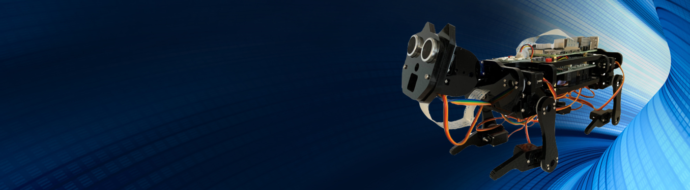
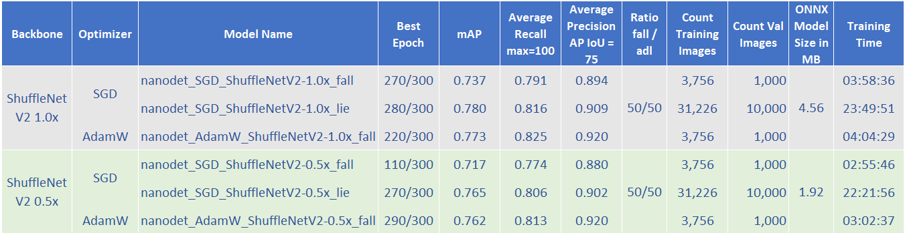

# Visual Fall Detector using NanoDet-Plus Model

This repository is created as part of the Master Thesis to obtain the academic degree Master of Science in Engineering (M. Sc. ) at the University of Applied Sciences Kufstein Tirol Bildungs GmbH. 

****
## Content

The repository contains the deep learning models for fall detection built with the use of the NanoDet-Plus model provided by Lyu on the following GitHub site: https://github.com/RangiLyu/nanodet. For the training the ImViA Fall dataset was taken from the following site: https://imvia.u-bourgogne.fr/en/database/fall-detection-dataset-2.html and prepared to meet the requirements for the MS-COCO image format.

Furthermore, the folder thesis contains the German questionnaire of a user acceptance test of the implementation of a mobile robot for fall detection along with the answers of 95 participants in a CSV file and an English evaluation provided in PowerBI and PDF. The folder also includes a checklist for the reproducibility of Data Science studies compiled for the thesis.

In the trained models folder, 6 different models are available for 4 different frameworks: ncnn, ONNX, PyTorch and Tensorflow Lite. The six different models are divided according to the ShuffleNetV2 1.0x and ShuffleNetV2 0.5x backbone used in training. Both variants were trained with the AdamW optimizer and the SGD optimizer. The models optimized with the SGD were also trained with other training data that does not classify the fall as such, but rather the lying of a person. These models are identified by the addition "_lie" instead of "_fall" in the name:

*  nanodet-plus-m_320_AdamW_ShuffleNetV2-1x_fall
*  nanodet-plus-m_320_SGD_ShuffleNetV2-1x_fall
*  nanodet-plus-m_320_SGD_ShuffleNetV2-1x_lie

*  nanodet-plus-m_320_AdamW_ShuffleNetV2-05x_fall
*  nanodet-plus-m_320_SGD_ShuffleNetV2-05x_fall
*  nanodet-plus-m_320_SGD_ShuffleNetV2-05x_lie

The notebooks folder contains 3 Jupyter notebooks that were set up to prepare the fall data, train the models on Google Colab and test the predictions of the PyTorch models:

*  VideoConverter
*  NanoDetTraining
*  NanoDetPrediction

In addition, it contains the onnx_nodes_fix.py file for the conversion of the models to TensorFlow as described in the NanoDetTraining Jupyter notebook and a folder with the pictures used in the notebooks.

The configuration folder contains the information about the software and software dependencies of the GoogleColab setup and the YAML configuration files for each model. Moreover, the hard- and software configurations of the Raspberry Pi are stated in a second subfolder. For reproduction of the training, the folder names in the YAML files have to be adjusted according to the settings made in the Jupyter Notebook "VideoConverter".

The evaluation of the models and the implementation with the corresponding metrics can be found in the evaluation folder. In addition, the folder contains the log files of the training sessions, which show the metrics in steps of 10 training epochs. A summary of the metrics is provided in the following table:

## Overview model results

The implementation folder contains the C++ files for the implementation of the models on the Raspberry Pi in the ncnn framework as well as a sample release of the nanodet-plus-m_320_AdamW_ShuffleNetV2-05x_fall model (nanodet-opt.param & nanodet-opt.bin) and a fall video from the training and the testing dataset. The files originally taken from the nanodet GitHub site were adjusted with the help of Q-engineering who offer a very good instruction site for implementation of machine learning models on Raspberry and Jetson Nano (https://qengineering.eu/). Their GitHub repository for the NanoDet-Plus model can be found at this site: https://github.com/Qengineering/NanoDetPlus-ncnn-Raspberry-Pi-4. 
Please note, however, that the files differ from the files provided in this GitHub repository since they were adjusted to meet the requirements of this project.

The results of the implementation showed almost 6 frames per second for the large models and 9 frames per seconds for the small models using over 80% of the capacity of the Raspberry Pi with a 32-bit operating system without being overclocked or using a hardware accelerator.

## Implementation Instructions

For the implementation of the fall detection on the Raspberry Pi OpenCV and the ncnn framework need to be installed. Depending on the operating system, follow the instructions of the Q-engineering site: https://qengineering.eu/install-ncnn-on-raspberry-pi-4.html and install Code::Blocks. Afterwards the implementation folder can be copied to the Raspberry Pi and the .bin and .param file of the chosen model in the ncnn version can be copied into the implementation folder. Delete the existing nanodet-opt.bin and nanodet-opt.param files and rename the copied model files accordingly. Now the NanoDetPlus.cbp file can be opened in Code::Blocks and a new Release can be built. Copy the NanoDetPlus Release from the bin file, the videos and the two model files to the pi folder and open the terminal. The detection can be run using the command: ./NanoDetPlus 2 "Fall.avi"

